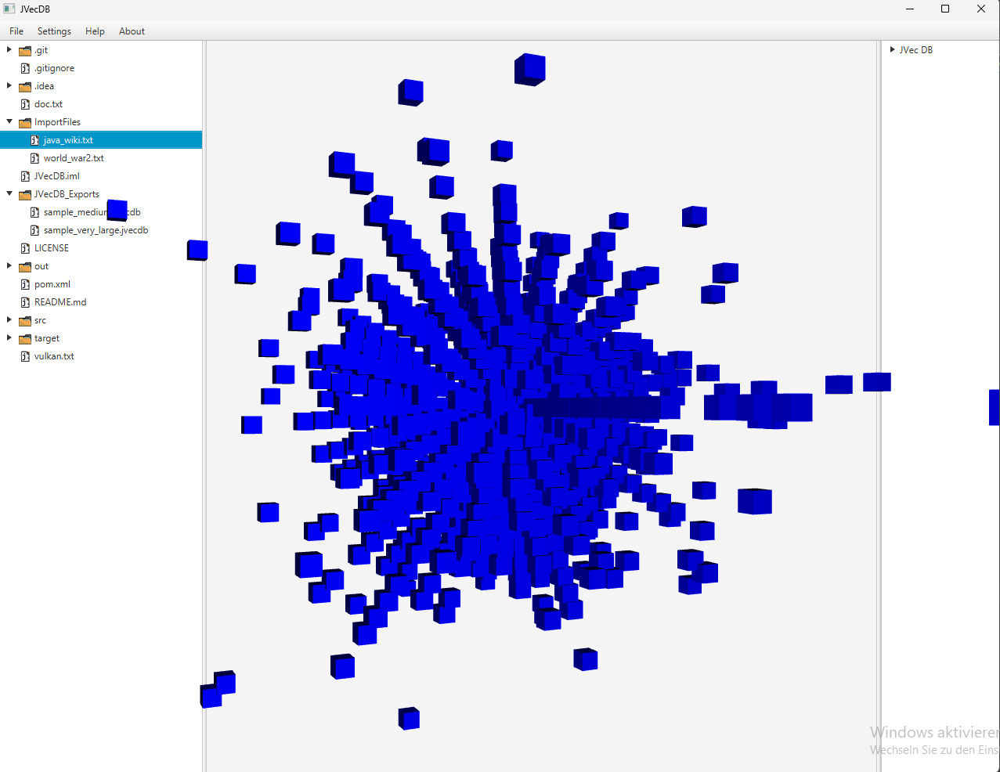

## JVecDB

#

JVec DB is a basic implementation of a vector database in java. As of release 1.0 it's still built from scratch but iam looking forward on using deeplearning4j to make it more sophisticated.   
For the UI I used the scenebuilder from [gluonhq](https://gluonhq.com/products/scene-builder/).
---
### Features  
-  3D Visualization of the vectors in space (only box form for now) through JavaFX 3D API
-  Exporting and importing of databases with a unique new filetype: `.jvecdb` (json metadata header and vector data as binary)
- JavaFX UI with folder browser (WIP)

### Roadmap

- Adding more filetypes (`.csv, .json`)
- Adding query features
- Expanding the UI

